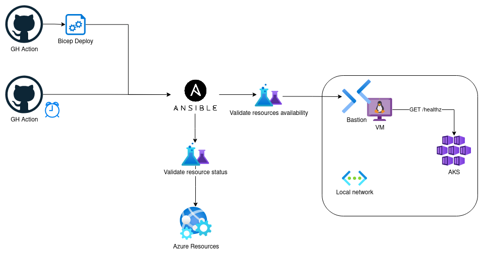

# test-4-infra

Structure to validate and test desired Azure infrasctructure states

This repository contains a set of validation scripts for testing Azure infrastructure. These scripts can be used as part of a CI/CD pipeline to ensure that changes made to your infrastructure as code do not break your environment.

## First Diagram

# Getting Started

To use this validation tool, you will need to have the following prerequisites:

 - [Azure CLI](https://learn.microsoft.com/en-us/cli/azure/install-azure-cli)
 - Ansible: `python3 -m pip install --user ansible`
    

Once you have these prerequisites installed, you can clone this repository to your local machine and navigate to the root directory.

# Github Actions Pipelines

This repository is configured with Github Actions pipelines that can be used to run the validation scripts automatically.
The pipelines are defined in the `.github/workflows` directory, and you can modify them to suit your specific requirements.

The pipelines include steps:
 - Install the prerequisites
 - Run validation scripts
 - Future: generate reports of the validation results.

# Contributing

If you would like to contribute to this repository, please submit a pull request with your proposed changes. 
We welcome contributions from the community to improve the effectiveness and coverage of the validation scripts.

# License

This repository is licensed under the MPL-2.0 license. See the LICENSE file for more information.

We hope you find this tool useful for testing your Azure infrastructure and ensuring the reliability of your environment. 
If you have any questions or feedback, please feel free to open an issue or submit a pull request.

